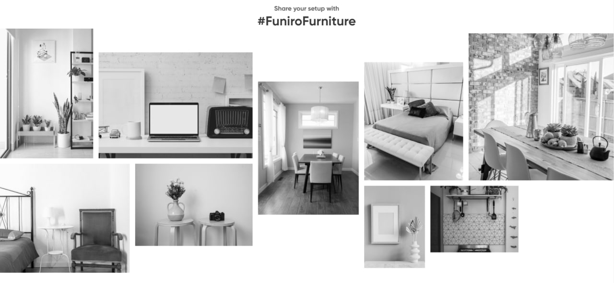

# Furniture
**Furniture** - this is a simple resume store site where you can see the *shopping cart*, *loading products* using the [Fetch API](https://developer.mozilla.org/en-US/docs/Web/API/Fetch_API/Using_Fetch).
It is also possible to see an example of using the [THREE.js](https://threejs.org/) library.

***If you don't need project folder you can just click on this link -> [Furnitura](https://danilnefedov.github.io/Furniture/).***


In the project, you can load additional products.

You can put one product item in the shopping cart. 
>*On the cart page, you can increase the quantity.*

In the shopping cart, you can delete a product or increase the quantity. You can also enter a discount card.

In the block shown in the picture you can select a product link to view it in detail.




___
## QUICK START
Download this progect to your computer.
1. Open your the command line Git and download the packages.
   ```
    npm i
   ```
2. Now we start the project.
   ```
   gulp build
   ```
:white_check_mark:
